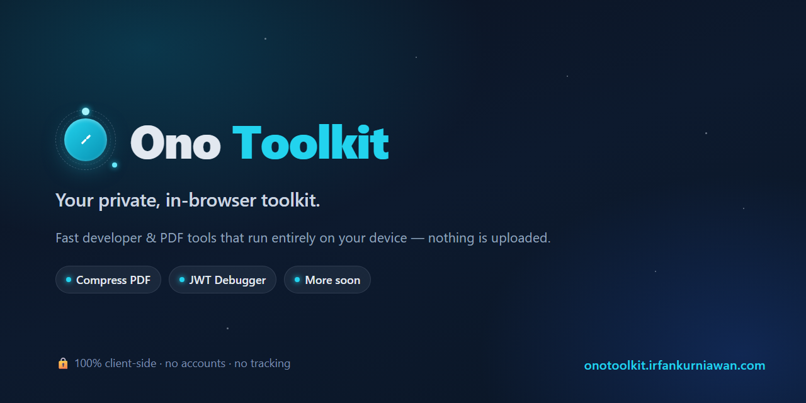

<div align="center">

<a href="https://onotoolkit.irfankurniawan.com">
  
</a>

# Ono Toolkit

**A suite of small, fast, privacy-first tools that run entirely in your browser.**
Your files and data never leave your device - no uploads, no accounts, no tracking.

[**Live → onotoolkit.irfankurniawan.com**](https://onotoolkit.irfankurniawan.com)

</div>

---

## Table of Contents

- [Features](#features)
- [Tech Stack](#tech-stack)
- [Getting Started](#getting-started)
- [Project Structure](#project-structure)
- [Adding a New Tool](#adding-a-new-tool)
- [Testing](#testing)
- [Contributing](#contributing)
- [License](#license)
- [Author](#author)

## Features

Everything runs client-side. Files, tokens, and secrets are processed locally
and are never sent to a server.

**Available**

- ✅ **Compress PDF** - shrink PDFs with adjustable quality (Ghostscript-WASM),
  with a before/after page preview slider.
- ✅ **JWT Debugger** (RFC 7519) - **Decoder** and **Encoder** tabs powered by
  [jose](https://github.com/panva/jose): a colored token editor, decoded
  header/payload with JSON highlighting, a claims breakdown with expiry state,
  optional **signature verification** and **signing/generation** across
  HS/RS/PS/ES/EdDSA (HMAC secret with a Base64URL switch, or a PEM/JWK key), and
  a "Generate example" that even mints key pairs in the browser.

**Coming soon**

- 🔜 Merge / Split / Rotate PDF
- 🔜 JSON Formatter
- 🔜 Markdown Preview

Plus a considered experience: light/dark themes, mobile-first responsive
layouts, motion.dev micro-interactions (an animated orbiting-planet logo and
cursor), and a privacy notice with a first-visit consent popup.

## Tech Stack

- **[Nuxt 4](https://nuxt.com/)** (Vue 3, SSR) with **[Nuxt UI](https://ui.nuxt.com/)**
- **[Pinia](https://pinia.vuejs.org/)** for state, **[Zod](https://zod.dev/)** for validation
- **[motion-v](https://motion.dev/docs/vue)** for animation
- **[jose](https://github.com/panva/jose)** (JWT), **[Ghostscript-WASM](https://github.com/jsscheller/ghostscript-wasm)** + **[pdf-lib](https://pdf-lib.js.org/)** + **[pdf.js](https://mozilla.github.io/pdf.js/)** (PDF)
- Heavy work runs in **Web Workers**; WASM is loaded lazily, client-side only.
- **TypeScript** throughout (no `any`), **ESLint** + **Prettier**, **Vitest** + **Playwright**.

## Getting Started

### Prerequisites

- **Node 24** (see `.node-version`)
- **pnpm 11** (`corepack enable` will provide it)

### Install & run

```bash
pnpm install
pnpm dev            # http://127.0.0.1:3000
```

### Production preview

```bash
pnpm build          # static + SSR build
pnpm --dir apps/web run preview
```

## Project Structure

```
onotoolkit/
  apps/web/                 # the Nuxt app
    app/
      components/           # layout/, tool/, ui/ (reusable, no giant components)
      composables/          # useGhostscript, usePdfRender, useJwt, useFileDownload
      pages/                # index.vue + tools/*.vue + privacy.vue
      stores/               # Pinia stores (one per tool)
      tools/registry.ts     # single source of truth for the tool catalog
      types/ utils/ schemas/ workers/
    tests/                  # Vitest unit + engine tests
  tests/e2e/                # Playwright end-to-end tests
  wrangler.jsonc            # Cloudflare Worker config
```

## Adding a New Tool

The tool catalog is driven by one registry, so adding a tool is small and
self-contained:

1. Add an entry to `apps/web/app/tools/registry.ts` (slug, title, description,
   icon, group, `status`, `route`). It appears on the landing page
   automatically.
2. Create `apps/web/app/pages/tools/<name>.vue` using the shared `ToolLayout`
   and UI components (`AppCard`, and helpers like `JsonHighlight`).
3. Put logic in a composable (`app/composables/`) and state in a Pinia store
   (`app/stores/`); keep pure, testable helpers in `app/utils/`.
4. Add Vitest unit tests and a Playwright e2e spec.

## Testing

```bash
pnpm validate       # format:check + lint + typecheck + unit tests + build
pnpm test           # unit tests (Vitest), incl. real Ghostscript + jose checks
pnpm test:e2e       # end-to-end (Playwright), desktop + mobile
```

Please make sure `pnpm validate` passes before opening a pull request.

## Contributing

Contributions are welcome! Please read **[CONTRIBUTING.md](CONTRIBUTING.md)** for
the workflow, coding standards, and how to open issues and pull requests. In
short: open an issue to discuss, branch from `main`, keep changes focused, run
`pnpm validate`, and open a PR.

## License

Licensed under **[AGPL-3.0](LICENSE)**. This is required because Ono Toolkit
bundles and serves **Ghostscript** (AGPL-3.0) for PDF compression, so the whole
distributed app must remain open-source under AGPL. If you fork or self-host a
modified version, you must also make your source available to your users.

## Author

Built by **[Muhammad Irfan Kurniawan](https://www.linkedin.com/in/muhammad-irfan-kurniawan)**.
